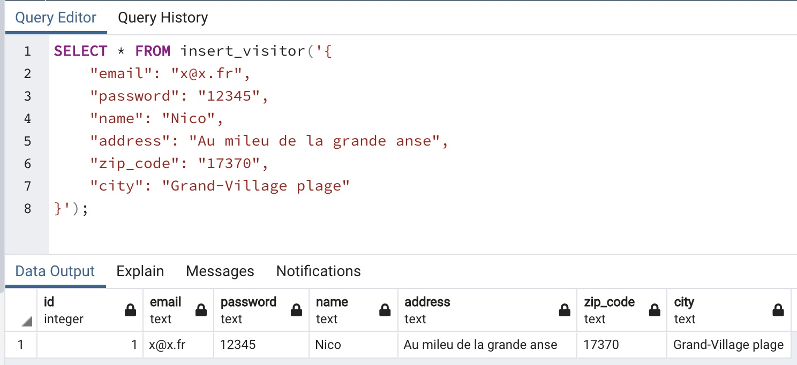
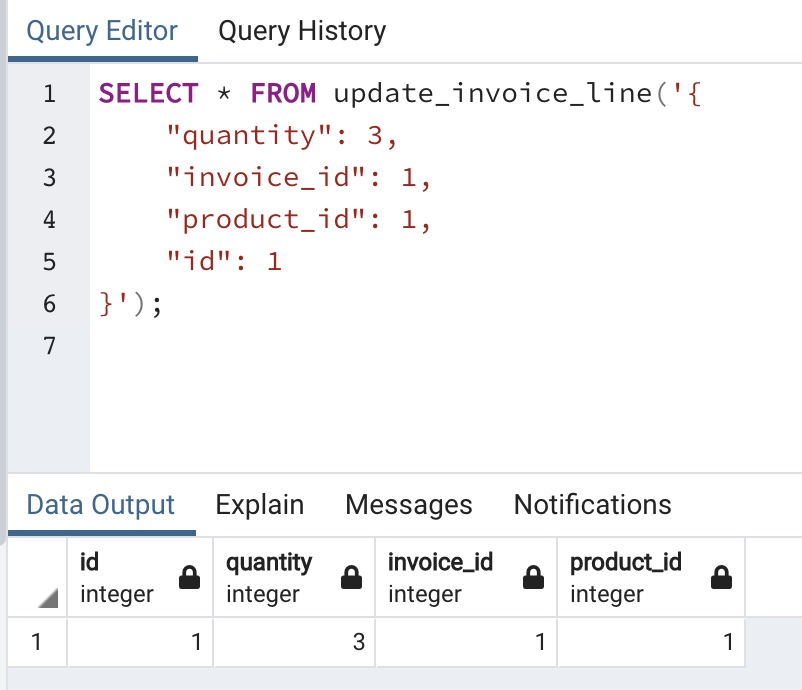
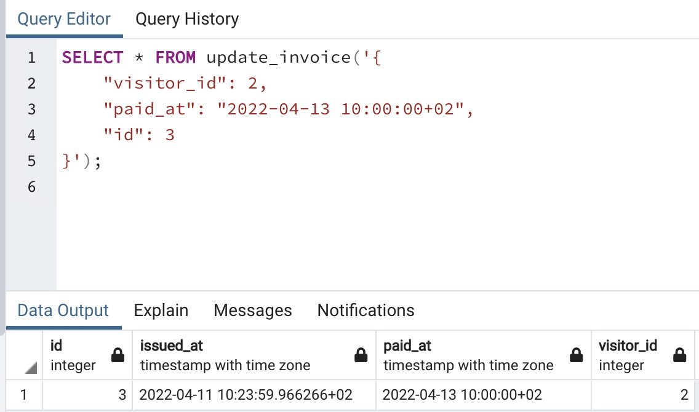
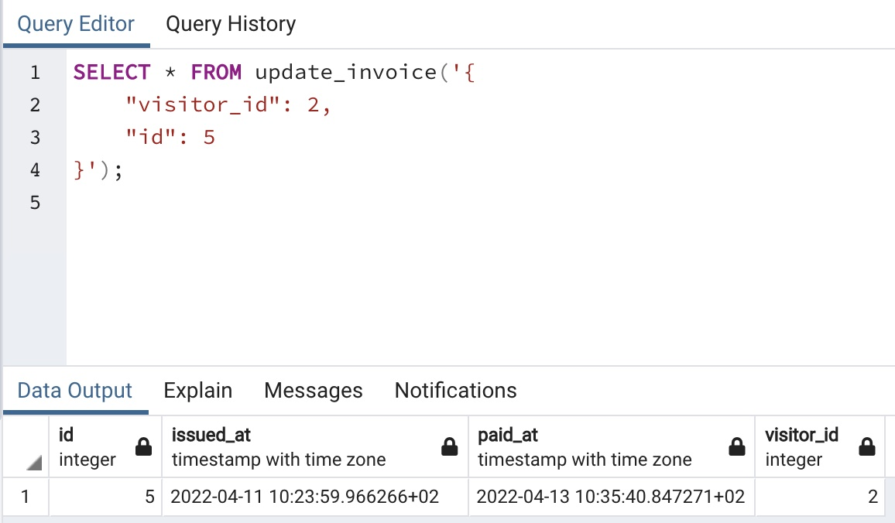
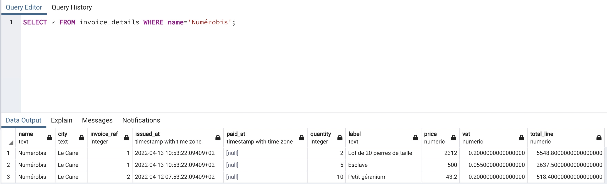
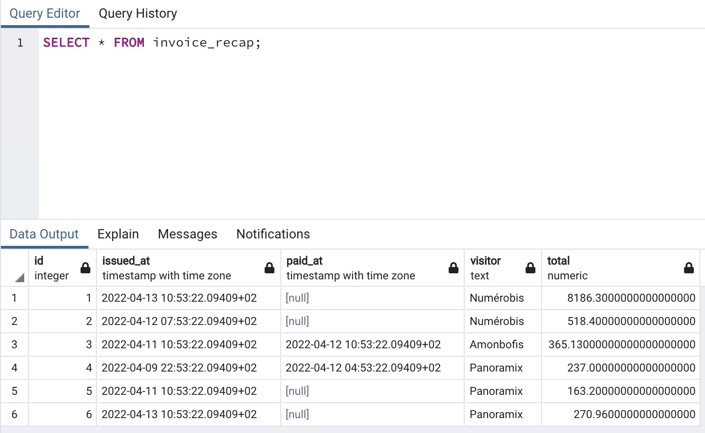

# oFact

Ceci est le résultat d'un projet d'une journée de travail (8h effective) en total autonnomie permettant de verifier la bonne utilisation de SQL / Sqitch / PgSQL.

Les questions et détails de l'exercice ne peuvent pas être divulgué car propriété de O'clock.

L'exercice a été rendue en l'état, question 6/7 et les retours des enseignants furent trés positifs.

## 1 - Création de la BDD

La base de données est appelée `ofact`.

## 2 - 1ère migration

Premiere migration nommée `init`

## 3 - 3ème forme normale

Corriger Le MCD pour respecter la 3ème forme normale (prix taxé et prix HT)


## 4 - API SQL

Requêtes pour insérer ou mettre à jour les entités : `crud_functions`

### Objectif

```sql
SELECT * FROM insert_visitor('{
    "email": "x@x.fr",
    "password": "12345",
    "name": "Nico",
    "address": "Au mileu de la grande anse",
    "zip_code": "17370",
    "city": "Grand-Village plage"
}')
```



```sql
SELECT * FROM update_invoice_line('{
    "quantity": 3,
    "invoice_id": 1,
    "product_id": 1,
    "id": 1
}');
```

Résultat attendu :



### feature

Pour la mise à jour d'une facture, faire en sorte de pouvoir omettre la date de paiement dans le json  
Si la valeur n'est pas présente, renseigner le champ avec la date et l'heure actuel

```sql
SELECT * FROM update_invoice('{
    "visitor_id": 2,
    "paid_at": "2022-04-13 10:00:00+02",
    "id": 3
}');
```

Résiltat attendu :


```sql
SELECT * FROM update_invoice('{
    "visitor_id": 2,
    "id": 5
}');
```

Résultat attendu :



## 5 - Jointures

Vue détaillée des factures : `invoice_details`.


### Objectif

```sql
SELECT * FROM invoice_details WHERE name='Numérobis';
```

Résultat attendu :


## 6 - Requêtes imbriquées

Vue récapitulative :  `invoice_recap` 

### Objectif

```sql
SELECT * FROM invoice_recap;
```

Résultat attendu :

